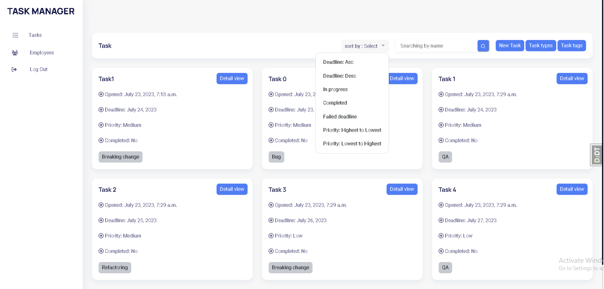

# Task Manager Project

Django pet-project for managing tasks, implemented in simple way without permissions and with django built-in login system 

## Check it out!
[Task manager project deployed to Render](https://task-manager-stsc.onrender.com/tasks/)

## Installation

Python3 must be already installed

```shell
git clone https://github.com/AntonShpakovych/task-manager-service/tree/develop
сd task-manager-service
python -m venv venv
venv\Scripts\activate
pip install -r requirements.txt
python manage.py runserver
```
## Test user

login: Tomzerw              
password: Tompassword123q!

## Demo

